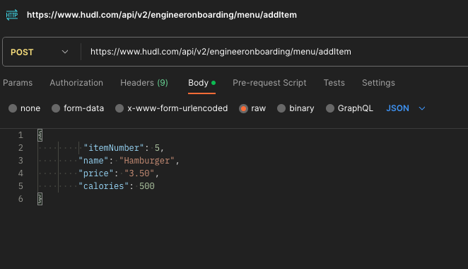

# Using Postman
[Postman](https://www.postman.com) is an API toolset that allows developers and QAs to build and test APIs. For our purposes in this capstone, we'll use the client feature to test a restaurant menu endpoint.

## Setup
- Download and install the Postman application [here](https://www.postman.com/downloads/).
- You may have to create a free account to use the Postman application.
- You can also try their web version, though this guide will mostly cover the local application and may or may not be applicable to the web application.

## Making an API GET call
- Back in Postman, click the `+` icon to open a new tab. Alternatively, you can go to `File > New Tab`. This should bring up a new tab with a blank Untitled Request.
- Make sure the call is set to `GET`
- Set the URL to `https://www.hudl.com/api/v2/engineeronboarding/menu`
- Log into Hudl in Google Chrome. If you need a refresher, refer back to the [guide on logging into Hudl](/guides/logging-into-hudl.md). 
- Open the Chrome Developer Tools by going `View > Developer > Developer Tools` in the menu. Click on the `Application` tab in the Developer Tools Menu. Click to open the `Cookies` on the left menu bar and choose the `https://www.hudl.com` domain. You should see a list of cookies -- search for the `ident` cookie. Once you find it, double click the value and copy it to your clipboard.
    - [Click here to watch a video of this workflow](https://drive.google.com/file/d/1uDobluiSRj1QMTz3pwQHEOlGObaSqfP9/view?usp=sharing)
- Back in Postman, click on `Headers` and add a new header with the key `Cookie` and set the value to `ident=` + the value you copied from Chrome Developer Tools.
    - 
- Now, hit `Send` and you should see the menu get returned in JSON form!

> Tip: The authtoken you set as a cookie in Postman will eventually expire. If it's been awhile since you've copied a new authtoken into Postman and your API calls aren't working, try logging into Hudl again to get another authtoken and replace your cookie value.
> This endpoint uses mocked data, so while adding and deleting items will return changes in the response payload, there's no database connected, so adding or deleting items won't persist those changes upon subsequent calls. That means if you add an item to the menu or delete an item, it'll work just for that one time. If you get the menu again, it'll be back to its original state.

## Making an API POST call
- Now, we'll make a POST call to make a change to the menu. Let's try adding a menu item.
- Change the method dropdown to the left of the URL input from `GET` to `POST`
- Add `/addItem` onto the end of your URL to make it `https://www.hudl.com/api/v2/engineeronboarding/menu/addItem`
- Under the URL input, click on the `Body` tab. Select the `raw` radio option and choose `JSON` from the dropdown.
- Add the following JSON to the body field
```json
{
    "itemNumber": 5,
    "name": "Hamburger",
    "price": "3.50",
    "calories": 500
}
```
- Check your settings against the screenshot below
    
- Hit `Send`. You should now see the Hamburger item returned in the response body.

## Making an API DELETE call
- See if you can figure out making a DELETE call on your own
> Hint: The endpoint for deleting an item is `https://www.hudl.com/api/v2/engineeronboarding/menu/deleteItem/{itemNumber}` with `itemNumber` being the item you want to delete.
